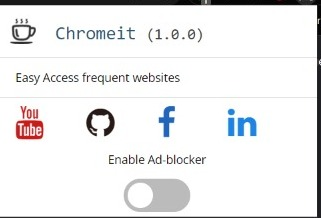

## Ad-blocker_Chrome-extn 💥
- Hi coders! I have tried my hands on this fun project of chrome extension please do check it out and suggest some changes or the features that I can add in future.
------
### Description ✨✨
- A chrome extension for the quick access of the social media handles, and also the ad blocking feature.
------
### Preview 📌📌
- This is the screenshot of the extension.  

------
### How to install this extension🧩🧩
- Go to chrome://extensions 
- Turn on the developer mode. 
- Click on Load Unpacked.
- Click on the downloaded zip file of the extension( I have provided the zip file in the repository).
- At last just enable the extension and it is ready to use.

